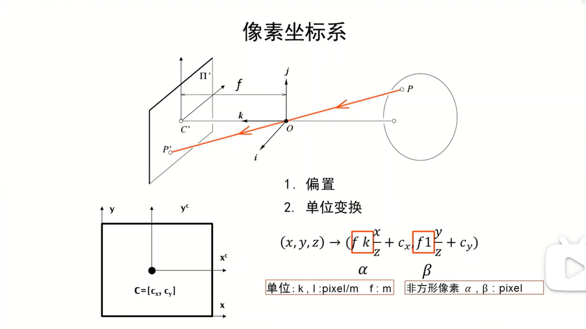
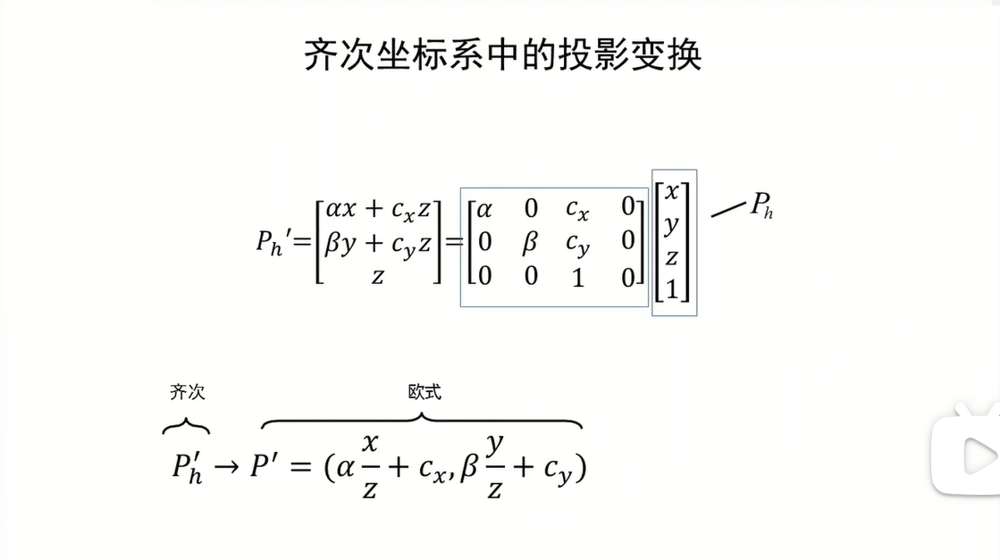
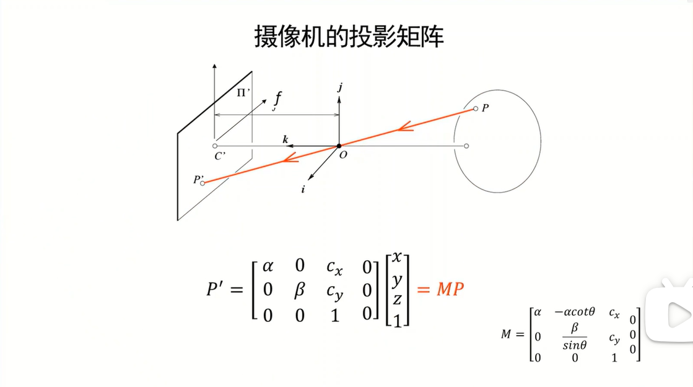

针孔&透镜

针孔：光圈，限制入射光线的数量，但会降低亮度

透镜：在实现针孔能力的同时，可以提升亮度，但存在失焦、畸变等问题

摄像机几何

偏置：$+c_x$ $+c_y$

单位变换：m2pixel

真实坐标系→像素坐标系

该变换是非齐次的，要将其改写为齐次变换：

欧式坐标↔齐次坐标：

$(x,y,z) \rightarrow \left[\begin{matrix}x\\y\\z\\1\end{matrix}\right]$					$\left[\begin{matrix}x\\y\\z\\w\end{matrix}\right] \rightarrow (\frac{x}{w},frac{y}{w},frac{z}{w})$

