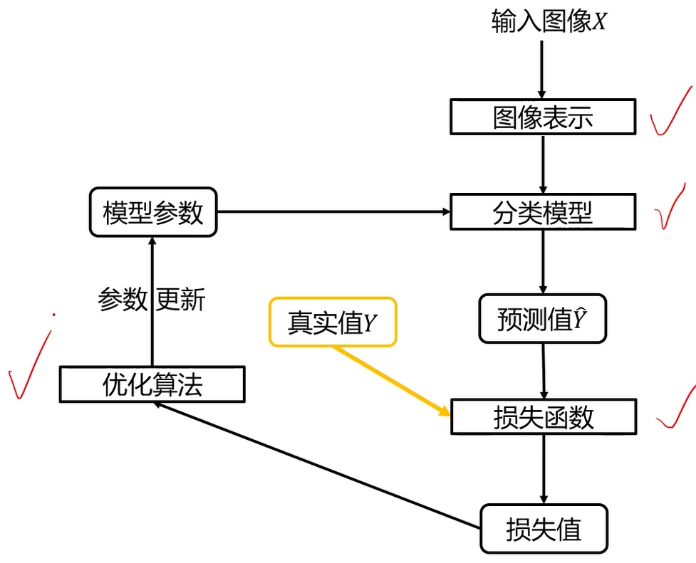
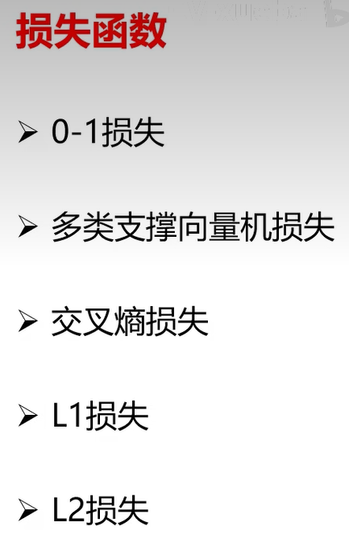
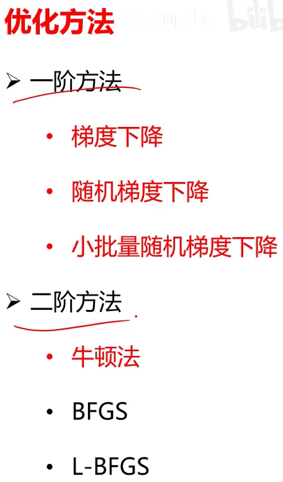

像素到语义的映射

ICCV CVPR

David Marr提出三部分：计算理论、表达和算法、硬件实现

视觉表达三阶段：输入图像→边缘图→2.5D简图→3D模型

图像中包含的信息：三维场景的结构信息、语义信息

图像分类、图像检测、图像分割、图像描述、图像生成

图像分类：

难题：语义鸿沟：建立到像素到语义的映射、视角、光照、尺度、遮挡、形变、背景杂波、类内形变、运动模糊、类别繁多

分类器设计与学习：

图像表示：

像素表示、全局特征表示（如GIST）、局部特征表示（如SIFT特征+词袋特征）

分类器：

损失函数：

优化方法：

