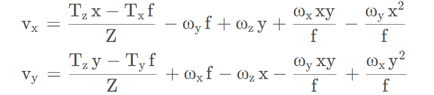
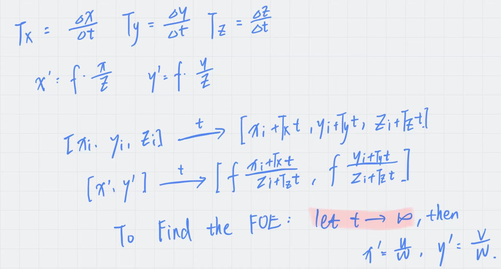
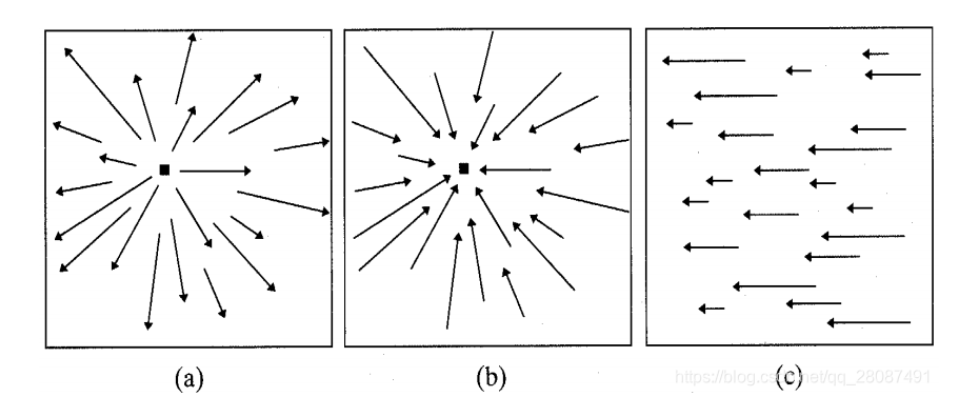

光流：

预测图片序列中场景点运动的方法

运动场：

图像点的速度的二维矢量场，三位速度矢量在图像平面上的映射

相机参考系下，场景点$P=\left[X,Y,Z\right]^T$，其在图像中的图像点$p=f\frac{P}{Z}$

场景点P与相机的相对运动为：$V=-T-\omega\times P$

T为运动的平移分量，$\omega$为角速度

若运动为刚体：

$V_x = -T_x-\omega_yZ+\omega_zY$

$V_y=-T_y-\omega_zX+\omega_xZ$

$V_z=-T_z-\omega_xY+\omega_yX$

场景点P速度V与图像点p速度v之间的关系：

对$p=f\frac{P}{Z}$求时间导数：$v=f\frac{ZV-V_zP}{Z^2}$

代入$V_x$，$V_y$，可得$v_x$，$v_y$：

这就是运动场的公式，注意其是两个分量的和（平移+旋转）：第一项为平移分量，后四项为旋转分量（注意到平移分量取决于深度Z，旋转分量取决于角速度$\omega$，角速度部分不含有深度信息）

当旋转分量为0时，

$v_x=\frac{T_zx-T_xf}{Z}$

$v_y=\frac{T_zy-T_yf}{Z}$

有且只有有一点$p_0=[x_0,y_0]^T$，根据针孔成像，有$x_0=f\frac{T_x}{T_z}$，$y_0=f\frac{T_y}{T_z}$

[https://www.doc.ic.ac.uk/~dfg/vision/v16.html]

代入消去$T_x$，$T_y$，有$v_x=(x-x_0)\frac{T_z}{Z}$，$v_y=(y-y_0)\frac{T_z}{Z}$

纯平移是径向的，包含了从共同原点p_0发散出来的向量

T_Z<0，**FOE**

T_Z>0，**FOC**

每个独立运动的物体，运动场向量来源同一点

