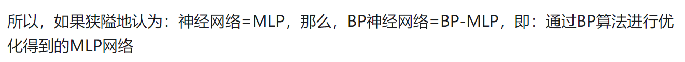
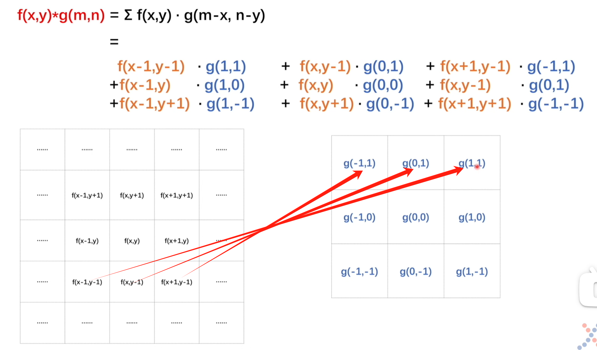
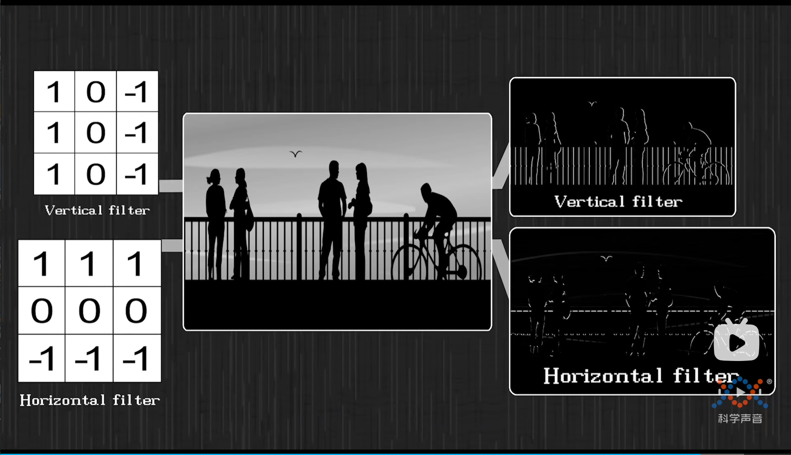

基础知识

* 数据操作、预处理
* 线性代数、微积分（向量、矩阵求导）

线性神经网络

* 线性回归

* softmax回归

多层感知机MLP

MLP就是ANN




深度学习计算

块

```python
class MLP(nn.Module):
    def __init__(self):
        super().__init__()
        self.hidden = nn.Linear(20, 256)  # 隐藏层
        self.out = nn.Linear(256, 10)  # 输出层

    def forward(self, X):
        return self.out(F.relu(self.hidden(X)))
```

forward可以自己定义，backward自动实现

参数访问

```python
net = nn.Sequential
net(2).state_dict()
print(*[(name, param.shape) for name, param in net.named_parameters()])
```

初始化


读写文件

```python
torch.save()
torch.load()
```

保存模型参数

```python
torch.save(net.state_dict(), 'mlp.params')
```

读取模型参数

```python
clone = MLP()
clone.load_state_dict(torch.load('mlp.params'))
clone.eval()
```


卷积

平移不变性、局部性

平滑卷积操作

从 $\int_{-\infty}^{\infty}f(t)g(x-t)dt$ 到对图像进行卷积



卷积核和g是相互旋转的关系！

如果卷积核合适，可以对图片进行过滤（垂直边界过滤器，水平边界过滤器）




卷积可以理解为一种特殊的全连接层：

$x_{k,l}$ 是二维图片中的一个像素的值，

在全连接下，将一半全连接中的$x$升到2维，有 $h_{i,j}=\sum_{k,l}w_{i,j,k,l}x_{k,l}$

令$v_{i,j,a,b}=w_{i,j,i+a,j+b}$，（即$w_{i,j,k,l}=v_{i,j,k-i,l-j}$）

有$h_{i,j}=\sum_{a,b}v_{i,j,a,b}x_{i+a,j+b}$

如果仍是全连接，复杂度太高了，基于平移不变性和局部性，可以做出限制，在降低复杂度的同时，保证正确性：

平移不变性，对v进行限制：$h_{i,j}=\sum_{a,b}v_{a,b}x_{i+a,j+b}$

局部性，对a b进行限制：$h_{i,j}=\sum_{a=-\Delta}^{\Delta}\sum_{b=-\Delta}^{\Delta}x_{i+a,j+b} \ \ (\Delta>0)$


